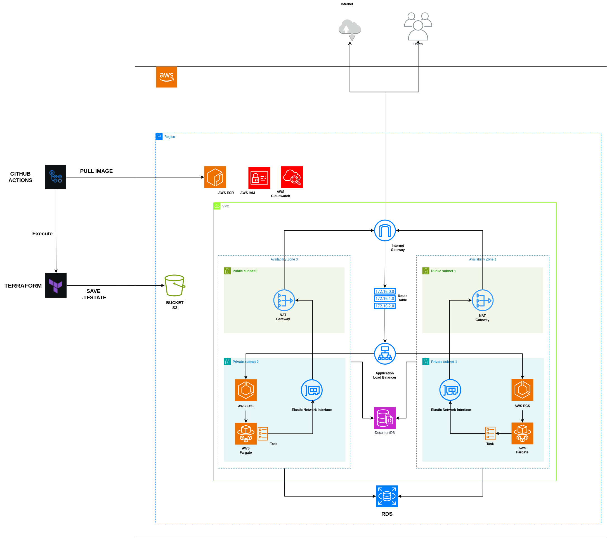

# SPG30  - Sistema de Ponto do Grupo 30

SPG30 é o nosso sistema de registro de ponto de funcionários.

# Escolha da tecnologia. 

Visando a agilidade tanto na criação da infra quanto do código optamos por utilizar a linguagem Java pois é uma linguagem de conhecimento de todo o time e optamos pelo framework Quarkus. 

Para saber mais sobre o framework acesse o site: https://quarkus.io/ .

# Linguagem Ubíqua 

Aqui nós definiremos os conceitos importantes para entender a nossa aplicação.

| Nome | Descrição |
|------| --------- | 
| Marcar ponto/Registrar ponto | Registrar o horário de entrada/saída do trabalho |
| Usuário | Pessoa que trabalha e precisa registrar o horário que entra e sai do trabalho |
| Visualizar registro | Obter informações sobre um usuário em um determinado dia |
| Gerar relatório | Obter dados  |
| Notificação | Mensagem recebida por sms ou e-mail lembrando que é preciso registrar o ponto |
| Usuário Administrador | Usuário com acessos especiais para poder gerar relatórios com pontos de outros usuários e aprovar alterações de ponto |

# Desenho do processo

Seguem aos principais pontos relacionados ao processo da aplicação.

 1. Existem 4 tipos de registros de ponto.

	* Primeira marcação - É o registro de entrada, é o horário em que se inicia a jornada de trabalho.

	 * Segunda marcação - É a saída para o almoço ou no caso dos estagiários é o ponto que registra o final da jornada.

	 * Terceira marcação - É a volta do almoço. Para evitar questões trabalhistas é preciso que entre a segunda e a terceira marcação exista um intervalo de pelo menos 1 hora.

	 * Quarta marcação - É a marcação que registra o final da jornada.

2. Os usuários conseguem visualizar o seu próprio histórico de ponto; 
3. Os usuários administradores podem visualizar o histórico de ponto de outros usuários;
4. Os usuários podem gerar relatório dos seus próprios registros de pontos;
5. Os usuários administradores conseguem gerar relatório de outros usuários; 
6. Os usuários podem editar os seus registros de ponto, porém a atualização precisa ser aprovada por um usuário administrador.

OBS. As funcionalidades de edição de ponto e relatório de administrador só serão contemplados na fase 2 do projeto.

Segue desenho dos processo de solução. 


# Fase 1

## Desenho da funcionalidade

O SPG30 nessa etapa será composto por dois micro serviços, um para autenticação do usuário(spg30-user) e outro responsável pelo registro, visualização de registros e geração de relatórios (spg30-backend). 

Esses dois serviços serão responsáveis por logar o usuário no sistema e por registrar os horários de trabalho. 

Além de permitir o registro de pontos, a aplicação é responsável pelo acompanhamento dos pontos e pela geração de um relatório de registros de pontos. 


## Infra

Para a infra, abaixo estão as  nossas principais escolhas:

* Escolhemos criar um micro serviço para gerenciar os acessos e a criação de usuários; 
* Utilizamos um banco de dados relacional(RDS) para armazenar as informações de usuário;
* Utilizamos um banco de dados não relacional (MongoDB) para armazenar as informações de ponto;
* Visando agilidade no desenvolvimento, subiremos a aplicação na AWS utilizando Fargate.
* Para automatizar o deploy da aplicação, estamos utilizando o CI/CD do github. 
* Para subir a aplicação na AWS nós subimos uma imagem no ECR e utilizamos o ECS para criar os containers
* Criamos uma VPC para interligar os serviços e estamos nos comunicando com a parte externa utilizando um internet gateway. 

Segue o desenho da infra que está sendo utilizada nessa primeira fase do projeto:



Segue modelo de entidade de relacionamento da aplicação de autenticação de usuário:


# Fase 2 (Evolução)

## Desenho da funcionalidade

Para a fase 2 serão implementadas algumas novas funcionalidades e outras irão sofrer algumas alterações: 
* Edição de registro - A API responsável pelos registros irá possuir um novo endpoint para permitir a atualização dos dados salvos. A edição do ponto deve ser aprovada por um usuário administrador
* Utilização do cognito para gerenciar os acessos dos usuários. Além disso, haverá a criação de um novo tipo de usuário, o administrador, que poderá visualizar todos os registros de ponto, independente de quem o registrou, além disso, ele poderá extrair um relatório gerencial .
* No endpoint de relatório, caso voce seja administrador, poderá acessar um relatório consolidado de todos os registros de pontos feitos em uma determinada data. 
* Será criado um endpoint de notificação responsável por lembrar aos funcionários que eles precisam realizar o registro do seu ponto.
* Para que se possa enviar uma notificação será preciso enviar uma mensagem para uma fila SQS e o serviço de notificação irá ler da fila e mandar um SMS/email informando para o usuário que faltou registrar um ponto. 
* Alteramos o Fargate para EC2 por ser mais econômico.
* Adicionamos um API Gateway para gerenciar os endpoints das apis.

Segue abaixo o desenho da solução atualizado:


Segue novo desenho de infra: 


# Execção de projeto

Para executar o projeto após clonar a pastado mesmo, será preciso executar alguns passos.

- 1° O java utilizado para este projeto deve ser a versão 21 para que possa ser executado corretamente.

- 2° Execute o comando abaixo na raiz do projeto:

```bash
    chmod 777 ./mvnw
 ```
- 3° Acesse em cada pasta do projeto '**spg30-user**' e '**spg30-backend**' e execute o comando abaixo:
```bash
    ./mvnw quarkus:dev
```
- 4° Ao acessar você encontrará diversos endpoints e junto deles o swagger para facilitar a usabilidade do projeto
- 5° Para facilidade os swagger de cada projeto são:
Para o serviço **spg30-user** http://localhost:8082/q/swagger-ui/
Para o serviço **spg30-backend** http://localhost:8081/q/swagger-ui/