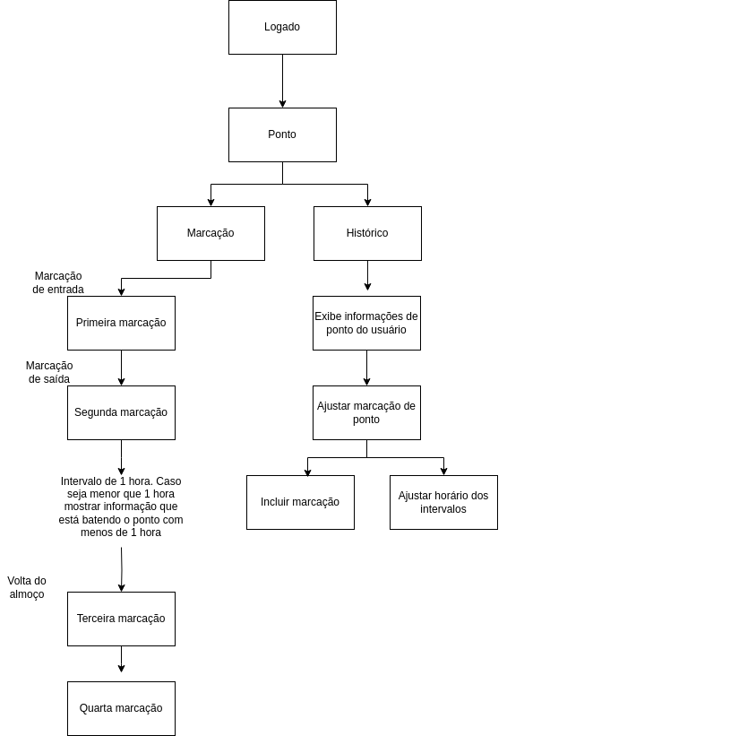

# SPG30 (Sistema de Ponto Grupo 30)

SPG30 é o nosso sistema de registro de ponto de funcionários.

O SPG30 é composto por dois microserviços, um para autenticação do usuário(spg30-user) e outro responsável pelo registro, visualização de registros e geração de relatórios (spg30-backend). 


Esses dois serviços serão responsáveis por logar o usuário no sistema e por registrar os horários de trabalho. 
Existem 4 tipos de registros de ponto.
* Primeira marcação - É o registro de entrada, é o horário em que se inicia a jornada de trabalho.
* Segunda marcação  - É a saída para o almoço ou no caso dos estagiários é o ponto que registra o final da jornada.
* Terceira marcação - É a volta do almoço. Para evitar questões trabalhistas é preciso que entre a segunda e a terceira marcação exista um intervalo de pelo menos 1 hora. 
* Quarta marcação - É a marcação que registra o final da jornada. 

Além de permitir o registro de pontos a aplicação é responsavel pelo acompanhamento dos pontos e pela geração de um relatório de registros de pontos. 

Segue desenho dos processo de solução. 



# Escolha da tecnologia. 

This project uses Quarkus, the Supersonic Subatomic Java Framework.

If you want to learn more about Quarkus, please visit its website: https://quarkus.io/ .

## Running the application in dev mode

You can run your application in dev mode that enables live coding using:
```shell script
./mvnw compile quarkus:dev
```

> **_NOTE:_**  Quarkus now ships with a Dev UI, which is available in dev mode only at http://localhost:8080/q/dev/.

## Packaging and running the application

The application can be packaged using:
```shell script
./mvnw package
```
It produces the `quarkus-run.jar` file in the `target/quarkus-app/` directory.
Be aware that it’s not an _über-jar_ as the dependencies are copied into the `target/quarkus-app/lib/` directory.

The application is now runnable using `java -jar target/quarkus-app/quarkus-run.jar`.

If you want to build an _über-jar_, execute the following command:
```shell script
./mvnw package -Dquarkus.package.type=uber-jar
```

The application, packaged as an _über-jar_, is now runnable using `java -jar target/*-runner.jar`.

## Creating a native executable

You can create a native executable using: 
```shell script
./mvnw package -Dnative
```

Or, if you don't have GraalVM installed, you can run the native executable build in a container using: 
```shell script
./mvnw package -Dnative -Dquarkus.native.container-build=true
```

You can then execute your native executable with: `./target/spg30-1.0.0-SNAPSHOT-runner`

If you want to learn more about building native executables, please consult https://quarkus.io/guides/maven-tooling.

## Related Guides

- SmallRye OpenAPI ([guide](https://quarkus.io/guides/openapi-swaggerui)): Document your REST APIs with OpenAPI - comes with Swagger UI
- RESTEasy Classic JSON-B ([guide](https://quarkus.io/guides/rest-json)): JSON-B serialization support for RESTEasy Classic
- RESTEasy Classic ([guide](https://quarkus.io/guides/resteasy)): REST endpoint framework implementing Jakarta REST and more
